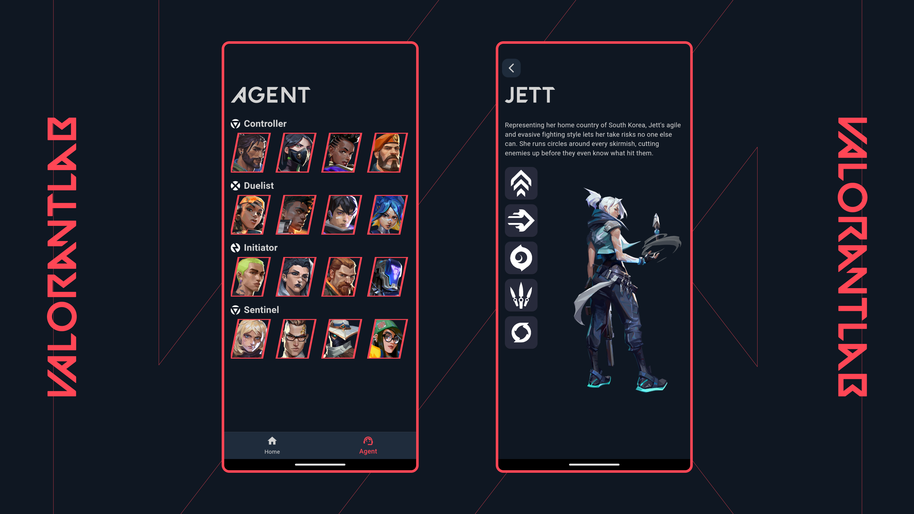

<br/>
<div align="center">
<a>

</a>
<h3 align="center">Valorantlab</h3>
<p align="center">
Valorant information app

</p>
</div>

## About The Project



This is my exploration of the Flutter project to build an app that shows information about the Valorant Game, such as the Agents, Maps, Weapons, etc.

The first version of this app came from my college exam [Here](https://example.com).

### Built With

- [Flutter](https://flutter.dev/)
- [Clean Architecture](https://blog.cleancoder.com/uncle-bob/2012/08/13/the-clean-architecture.html)
- [Melos](https://pub.dev/packages/melos)
- [Bloc State Management](https://pub.dev/packages/flutter_bloc)
- [Flutter Flavoriz](https://pub.dev/packages/flutter_flavorizr)
- [Flutter Launcher Icons](https://pub.dev/packages/flutter_launcher_icons)
- [Go Router](https://pub.dev/packages/go_router)
- [Get It](https://pub.dev/packages/get_it)
- [Isar Database](https://pub.dev/packages/isar)
- [Freezed](https://pub.dev/packages/freezed)
- [Dartz](https://pub.dev/packages/dartz)
- [Http](https://pub.dev/packages/http)
- [Flutter SVG](https://pub.dev/packages/flutter_svg)
- [Flutter Gen](https://pub.dev/packages/flutter_gen)
- [Equatable](https://pub.dev/packages/equatable)
- [Husky](https://pub.dev/packages/husky)
- [Commitlint](https://pub.dev/packages/commitlint_cli)

## Getting Started

1. Clone the repo

   ```sh
   git clone https://github.com/rizaadi/valorantlab.git

   cd valorantlab
   ```

2. Install NPM packages

   ```sh
   dart pub global activate melos
   ```

3. Bootstrap the Project with Melos and fetch dependencies

   ```sh
   melos bootstrap
   ```

4. Running the App

   ```sh
   flutter run
   ```

## Roadmap

- [x] Clean Architecture
- [x] Dependency Injection
- [x] Flavors
- [x] Unit Testing
- [x] Modularization
- [ ] Publish to Playstore/Appstore
- [ ] CI/CD with fastlane
- [ ] Localization (EN & ID)

## License

Distributed under the MIT License. See [MIT License](https://github.com/rizaadi/valorantlab/blob/1c93f8261d7cb0c0bc2650b0ed6b8a9a5efeb716/LICENSE) for more information.

## Contact

Riza Adi Kurniawan - rizaadi890@gmail.com
