<br/>
<div align="center">
<a>

</a>
<h3 align="center">Valorantlab</h3>
<p align="center">
Valorant information app

</p>
</div>

## About The Project


This project is my exploration with Flutter to build an app that displays information about the game Valorant, including detail on Agents, Maps, Weapons, and more.

The first version of this app originated from my college exam, as described [Here](https://www.rizaadikurniawan.com/project/valorantlab), and I later refactored it.

## 🏗️ Project Architecture

This project follows **Clean Architecture** principles and uses **Melos** for monorepo management. The architecture is organized into multiple packages:

### 📦 Package Structure

```
valorantlab/
├── 📱 app (main)           # Main Flutter application
├── 🎯 features/            # Feature-specific packages
│   ├── agent/              # Agent feature (list, detail, management)
│   ├── home/               # Home screen and navigation
│   └── weapon/             # Weapon feature (list, detail, stats)
├── 📦 packages/            # Core infrastructure
│   └── core/               # Shared utilities, database, networking
└── 🔄 shared/              # Shared dependencies and resources
    ├── dependencies/       # Common dependencies and configurations
    └── i18n/               # Internationalization (EN/ID support)
```

### Built With

- [Flutter](https://flutter.dev/)
- [Clean Architecture](https://blog.cleancoder.com/uncle-bob/2012/08/13/the-clean-architecture.html)
- [Melos](https://pub.dev/packages/melos)
- [Bloc State Management](https://pub.dev/packages/flutter_bloc)
- [Flutter Flavoriz](https://pub.dev/packages/flutter_flavorizr)
- [Flutter Launcher Icons](https://pub.dev/packages/flutter_launcher_icons)
- [Go Router](https://pub.dev/packages/go_router)
- [Get It](https://pub.dev/packages/get_it)
- [Isar Database](https://pub.dev/packages/isar)
- [Freezed](https://pub.dev/packages/freezed)
- [Dartz](https://pub.dev/packages/dartz)
- [Http](https://pub.dev/packages/http)
- [Flutter SVG](https://pub.dev/packages/flutter_svg)
- [Flutter Gen](https://pub.dev/packages/flutter_gen)
- [Equatable](https://pub.dev/packages/equatable)
- [Husky](https://pub.dev/packages/husky)
- [Commitlint](https://pub.dev/packages/commitlint_cli)

## 🚀 Getting Started

### Prerequisites

- **Flutter SDK**: Latest stable version
- **Dart**: Comes with Flutter
- **Melos**: For monorepo management

### Quick Setup

1. **Clone the repository**

   ```sh
   git clone https://github.com/rizaadi/valorantlab.git
   cd valorantlab
   ```

2. **Install Melos globally**

   ```sh
   dart pub global activate melos
   ```

3. **Setup development environment**

   ```sh
   melos run dev:setup
   ```

4. **Start development**
   ```sh
   melos run build:watch
   ```

## 🛠️ Melos Commands Reference

This project uses **Melos** for comprehensive monorepo management. Here are all available commands:

### 🚀 Quick Start Commands

| Command                 | Description                            |
| ----------------------- | -------------------------------------- |
| `melos bootstrap`       | Setup all packages and dependencies    |
| `melos run dev:setup`   | Complete development environment setup |
| `melos run build:watch` | Start development with hot reload      |
| `melos run dev:doctor`  | Check development environment health   |

### 🧪 Testing & Quality Assurance

| Command                      | Description                     |
| ---------------------------- | ------------------------------- |
| `melos run test`             | Run all tests across packages   |
| `melos run test:coverage`    | Run tests with coverage reports |
| `melos run test:unit`        | Run unit tests only             |
| `melos run test:integration` | Run integration tests           |
| `melos run test:watch`       | Run tests in watch mode         |
| `melos run verify`           | Pre-commit quality checks       |

### 📦 Build & Release

| Command                             | Description                           |
| ----------------------------------- | ------------------------------------- |
| `melos run build`                   | Build production APK                  |
| `melos run build:dev`               | Build development APK                 |
| `melos run build:apk`               | Build Android APK (production)        |
| `melos run build:appbundle`         | Build Android App Bundle (Play Store) |
| `melos run build:appbundle:dev`     | Build development App Bundle          |
| `melos run build:appbundle:profile` | Build profile App Bundle              |
| `melos run build:ios`               | Build iOS app (production)            |
| `melos run release`                 | Complete release workflow             |

### 🔧 Development Tools

| Command                    | Description                   |
| -------------------------- | ----------------------------- |
| `melos run analyze`        | Run code analysis             |
| `melos run lint`           | Run stricter linting          |
| `melos run lint:fix`       | Auto-fix linting issues       |
| `melos run format`         | Format all Dart files         |
| `melos run format:fix`     | Fix formatting issues         |
| `melos run generate`       | Run code generation           |
| `melos run generate:watch` | Code generation in watch mode |

### 🎯 Scoped Commands (Package-Specific)

| Command                    | Description                 |
| -------------------------- | --------------------------- |
| `melos run features:test`  | Test only feature packages  |
| `melos run features:build` | Build only feature packages |
| `melos run core:test`      | Test only core packages     |
| `melos run shared:test`    | Test only shared packages   |

### 📊 Monitoring & Maintenance

| Command                     | Description                       |
| --------------------------- | --------------------------------- |
| `melos run metrics`         | Generate code quality metrics     |
| `melos run docs:generate`   | Generate API documentation        |
| `melos run docs:deps:graph` | Generate Mermaid dependency graph |
| `melos run docs:serve`      | Serve documentation locally       |
| `melos run security:check`  | Security vulnerability audit      |

### 🔄 Version Management

| Command                        | Description             |
| ------------------------------ | ----------------------- |
| `melos run version:patch`      | Bump patch version      |
| `melos run version:minor`      | Bump minor version      |
| `melos run version:major`      | Bump major version      |
| `melos run version:prerelease` | Bump prerelease version |
| `melos run changelog:generate` | Generate changelog      |

### 🚀 CI/CD Integration

| Command               | Description                |
| --------------------- | -------------------------- |
| `melos run ci:setup`  | Setup CI environment       |
| `melos run ci:test`   | Run CI tests with coverage |
| `melos run ci:build`  | Build for CI deployment    |
| `melos run ci:deploy` | Complete CI/CD pipeline    |

### 🧹 Cleanup Commands

| Command                | Description                     |
| ---------------------- | ------------------------------- |
| `melos clean`          | Clean all packages              |
| `melos run clean:deep` | Deep clean with generated files |
| `melos run dev:reset`  | Reset development environment   |

### ⚡ Performance & Optimization

| Command                  | Description           |
| ------------------------ | --------------------- |
| `melos run perf:profile` | Build profile version |

### 📋 Package Management

| Command                   | Description                       |
| ------------------------- | --------------------------------- |
| `melos run get`           | Get dependencies for all packages |
| `melos run deps:upgrade`  | Upgrade all dependencies          |
| `melos run deps:outdated` | Check for outdated dependencies   |

## 🔍 Dependency Graph Analysis

### View Package Dependencies

You can analyze package relationships using melos commands:

```bash
# List all packages with details
melos list --long

# Show dependency graph as JSON
melos list --graph

# Generate visual dependency graph (Graphviz format)
melos list --gviz

# Check for dependency cycles
melos list --cycles
```

### 🔄 Dependency Graph

The dependency relationships between packages visualized using Mermaid:

```mermaid
graph TD
    %% Package definitions
    valorantlab["🏠 valorantlab<br/>Main App"]
    agent["🎭 agent<br/>Agent Feature"]
    home["🏡 home<br/>Home Feature"]
    weapon["⚔️ weapon<br/>Weapon Feature"]
    core["🛠️ core<br/>Infrastructure"]
    dependencies["📦 dependencies<br/>Shared Deps"]
    i18n["🌐 i18n<br/>Localization"]

    %% Dependencies
    valorantlab --> agent
    valorantlab --> home
    valorantlab --> weapon
    valorantlab --> core
    valorantlab --> dependencies
    valorantlab --> i18n

    agent --> weapon
    agent --> core
    agent --> dependencies
    agent --> i18n

    home --> core
    home --> dependencies

    weapon --> agent
    weapon --> core
    weapon --> dependencies
    weapon --> i18n

    core --> agent
    core --> home
    core --> weapon
    core --> dependencies
    core --> i18n

    %% Styling
    classDef mainApp fill:#e1f5fe,stroke:#01579b,stroke-width:3px
    classDef feature fill:#f3e5f5,stroke:#4a148c,stroke-width:2px
    classDef infrastructure fill:#e8f5e8,stroke:#1b5e20,stroke-width:2px
    classDef shared fill:#fff3e0,stroke:#e65100,stroke-width:2px

    class valorantlab mainApp
    class agent,home,weapon feature
    class core infrastructure
    class dependencies,i18n shared
```



**Key Dependencies:**

- **Main App** → All features + core + shared packages
- **Features** → Core + shared packages for common functionality
- **Core** → Shared packages for base utilities
- **Shared** → No dependencies (foundation level)

### Understanding the Architecture

- **🏢 Main App (`valorantlab`)**: Entry point that depends on all features and core packages
- **🎯 Feature Packages**: Independent features that can be developed separately
  - `agent`: Manages agent-related functionality
  - `home`: Handles home screen and navigation
  - `weapon`: Manages weapon-related features
- **🛠️ Core Package**: Shared infrastructure (database, networking, utilities)
- **📦 Shared Packages**: Foundation-level packages
  - `dependencies`: Common dependencies and configurations
  - `i18n`: Internationalization support

## 💻 Development Workflow

### Setting up Development Environment

1. **Initial Setup**

   ```bash
   # Clone and setup
   git clone https://github.com/rizaadi/valorantlab.git
   cd valorantlab

   # Install melos and setup environment
   dart pub global activate melos
   melos run dev:setup
   ```

2. **Daily Development**

   ```bash
   # Start development server
   melos run build:watch

   # Run tests continuously
   melos run test:watch

   # Check code quality
   melos run verify
   ```

3. **Before Committing**

   ```bash
   # Format code
   melos run format:fix

   # Run all quality checks
   melos run verify

   # Run full test suite
   melos run test:coverage
   ```

### Feature Development Process

1. **Create Feature Branch**

   ```bash
   git checkout -b feature/new-feature
   ```

2. **Develop with Scoped Commands**

   ```bash
   # Test only your feature
   melos run features:test --scope=your-feature

   # Build only your feature
   melos run features:build --scope=your-feature
   ```

3. **Quality Assurance**

   ```bash
   # Run comprehensive checks
   melos run verify
   melos run test:coverage
   melos run analyze
   ```

4. **Prepare for Release**

   ```bash
   # Version management
   melos run version:patch

   # Generate changelog
   melos run changelog:generate

   # Build release
   melos run release
   ```

## 🚀 CI/CD Integration

### GitHub Actions Example

Create `.github/workflows/ci.yml`:

```yaml
name: CI/CD Pipeline

on:
  push:
    branches: [main, develop]
  pull_request:
    branches: [main]

jobs:
  test:
    runs-on: ubuntu-latest
    steps:
      - uses: actions/checkout@v3

      - name: Setup Flutter
        uses: subosito/flutter-action@v2
        with:
          flutter-version: "3.16.0"

      - name: Setup Melos
        run: dart pub global activate melos

      - name: Setup CI Environment
        run: melos run ci:setup

      - name: Run Tests
        run: melos run ci:test

      - name: Build App
        run: melos run ci:build

      - name: Deploy
        if: github.ref == 'refs/heads/main'
        run: melos run ci:deploy
```

### Available CI Commands

| Command               | Purpose                | Usage                             |
| --------------------- | ---------------------- | --------------------------------- |
| `melos run ci:setup`  | Prepare CI environment | Sets up packages and dependencies |
| `melos run ci:test`   | Run CI tests           | Executes tests with coverage      |
| `melos run ci:build`  | Build for deployment   | Generates release builds          |
| `melos run ci:deploy` | Deploy application     | Full deployment pipeline          |

## 🔧 Troubleshooting

### Common Issues

**1. Build Failures**

```bash
# Clean and reset everything
melos run clean:deep
melos run dev:reset

# Check environment
melos run dev:doctor
```

**2. Dependency Conflicts**

```bash
# Check for outdated packages
melos run deps:outdated

# Upgrade dependencies
melos run deps:upgrade
```

**3. Test Failures**

```bash
# Run tests with detailed output
melos run test:coverage

# Test specific packages
melos run features:test --scope=package-name
```

**4. Code Generation Issues**

```bash
# Clean and regenerate
melos run build:clean
melos run generate
```

### Performance Tips

- Use scoped commands for faster development
- Run `melos run test:watch` during development
- Use `melos run build:watch` for hot reload
- Regular `melos run clean:deep` for optimal performance

## 📋 Roadmap

### ✅ Completed

- [x] Clean Architecture implementation
- [x] Dependency Injection with GetIt
- [x] Flutter Flavors (dev/prod)
- [x] Comprehensive Unit Testing
- [x] Modularization with Melos
- [x] Localization (EN & ID)
- [x] Melos monorepo management
- [x] CI/CD scripts and workflows
- [x] Code quality automation
- [x] Comprehensive testing framework

### 🚧 In Progress

- [ ] Advanced CI/CD with deployment automation
- [ ] Publish to Play Store/App Store

### 🔮 Future Goals

- [ ] Performance optimization
- [ ] Widget testing expansion
- [ ] Performance monitoring and analytics
- [ ] Advanced security features

## License

Distributed under the MIT License. See [MIT License](https://github.com/rizaadi/valorantlab/blob/1c93f8261d7cb0c0bc2650b0ed6b8a9a5efeb716/LICENSE) for more information.

## Contact

[Riza Adi Kurniawan](https://www.linkedin.com/in/rizaadikurniawan/) - rizaadi890@gmail.com
